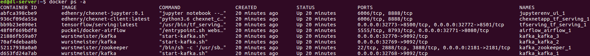
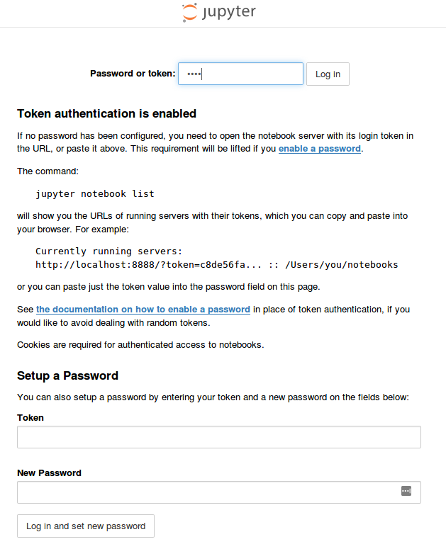
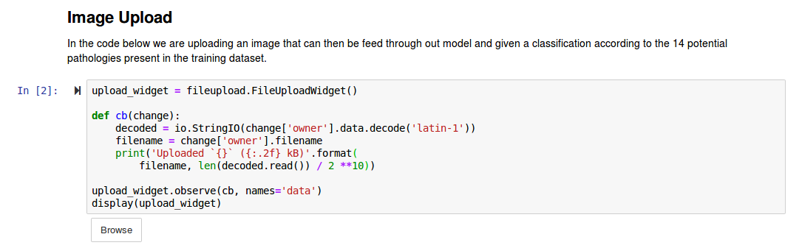
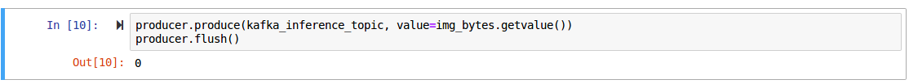

# Quickstart for Using a Pre-trained model

## Building the environment with Ansible

***Note this environment is hard coded using the IP address range of 172.23.0.0/24 -- please be aware that if you have any virtual environments / VPN's utilizing this address range it will not function***

To build the "production" pipeline environment using the provided ansible playbook, and plays, issue the following commands:

**1.** `ansible-playbook -i hosts build_site.yml` - this will download all of the required docker containers and build the docker-compose environments accordingly

**2.** `docker ps -a` - verify all of the docker containers are running (image below)

**3.** Browse to `http://172.23.0.20:8888/tree?` using your favorite web browser - you will be presented with the login prompt for the jupyter notebook

**4.** Use the password `demo` for the authentication -- you can also use the `Setup a Password` option that will allow you to reset the password to whatever you would like.

**5.** Browse to the `jupyter-env` directory within the notebook UI

**6.** Open the `ChexNet Workflow Example.ipynb` notebook

Once you're within the notebook context you can sequentially execute the notebook cells allowing you to upload an image to the notebook along with publish the image to Kafka where it will then be sent through the trained model being hosted on TensorFlow Serving, and the results will be published back to Kafka which can be retrieved using later cells in the Jupyter Notebook. A diagram of the inference pipeline is shown below : 

## Uploading an image to the Jupyter Notebook

If you've downloaded the [NIH's ChestX-ray14 dataset](https://www.nih.gov/news-events/news-releases/nih-clinical-center-provides-one-largest-publicly-available-chest-x-ray-datasets-scientific-community) - then you can browse on your local disc to upload one of the images from that dataset to perform inference over. This is just an example way to perform inference on an image. Typically one wouldn't use the training / validation / test set for true measurement of a model's performance, but this will give the end user a feel for how this model works.

If you have not downloaded the NIH dataset, I have provided a directory of images within the `chexnet` directory cloned from the [Github repo](https://github.com/edhenry/chexnet). These images can also be used.

To upload an image and run it through our trained model - follow the below steps :

**1.** Run all notebook cells up to and including the `Image Upload` cell and the code listed directly below - this should present a `Browse` box that is a file upload that can be used to pass an image into the Jupyter notebook.

**2.** Select an image from your local filesystem

**3.** Once this image is uploaded, execute the next block of code within the jupyter notebook and it will display the image you've uploaded.

**4.** Publish the image to Kafka by executing the next block of code with the `producer.produce()` function defined.

**5.** Execute the next block of code that will collect the results from kafka and produce a bar chart of the different pathologies and the probability of a given pathology for your input image

**6.** Execute the last block of code and you will be presented with a [Class Activation Map](http://cnnlocalization.csail.mit.edu/) overlay of your original input image.

The jupyter notebook logic is outlined below :

